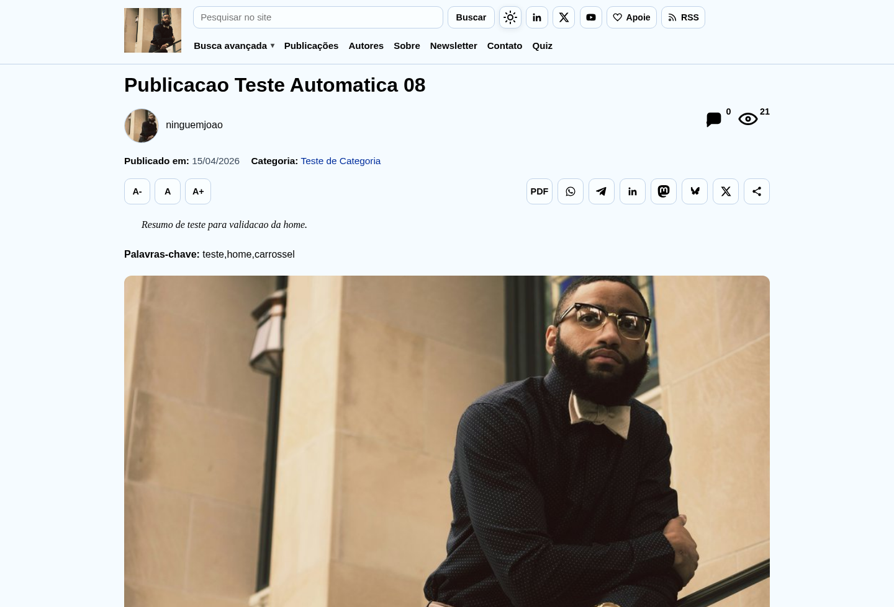
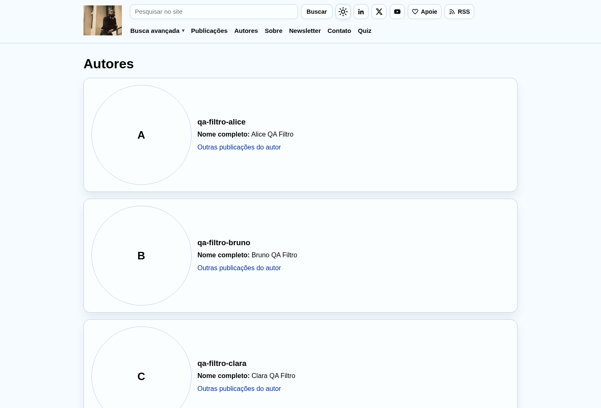
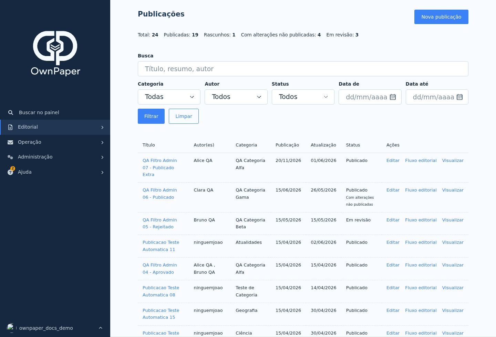
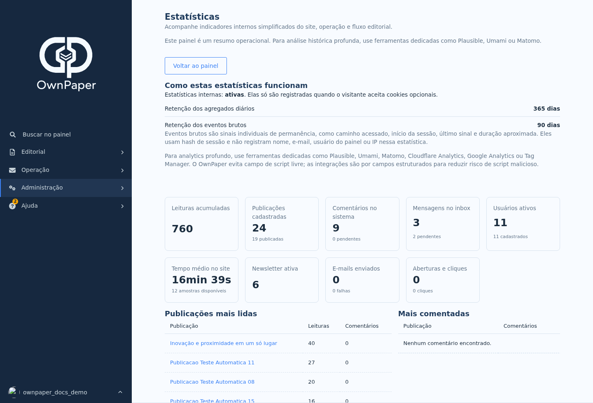
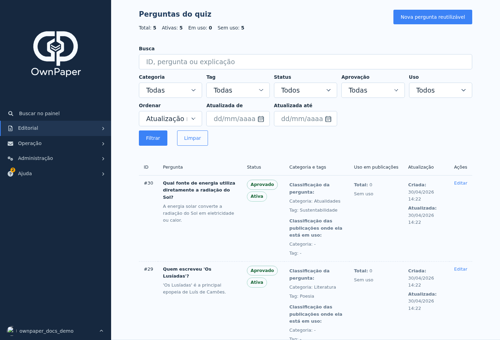
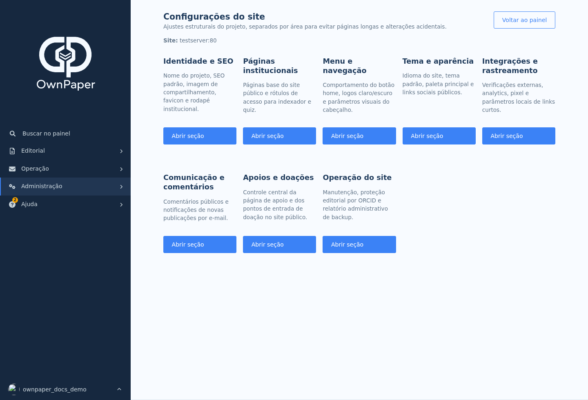

# Tour visual

Esta página reúne capturas representativas do site público e do painel administrativo.

As telas públicas foram capturadas de uma instalação de teste em HTTPS para mostrar mídia real. As telas administrativas foram capturadas em ambiente local com usuário temporário de documentação, evitando expor inbox, e-mails, usuários ou dados sensíveis.

## Site público

<figure class="ownpaper-screenshot-card">
  
  <figcaption>Home pública com menu, busca, destaques e últimas publicações.</figcaption>
</figure>

<figure class="ownpaper-screenshot-card">
  
  <figcaption>Listagem de publicações com filtros e navegação editorial.</figcaption>
</figure>

<figure class="ownpaper-screenshot-card">
  
  <figcaption>Página de publicação com leitura pública, autoria e componentes editoriais.</figcaption>
</figure>

<figure class="ownpaper-screenshot-card">
  
  <figcaption>Área pública de autores com referências visuais e perfis.</figcaption>
</figure>

## Painel administrativo

<figure class="ownpaper-screenshot-card">
  
  <figcaption>Painel inicial com visão rápida, busca e atalhos operacionais.</figcaption>
</figure>

<figure class="ownpaper-screenshot-card">
  
  <figcaption>Listagem administrativa de publicações com filtros e fluxo editorial.</figcaption>
</figure>

<figure class="ownpaper-screenshot-card">
  
  <figcaption>Estatísticas internas agregadas para acompanhamento rápido.</figcaption>
</figure>

<figure class="ownpaper-screenshot-card">
  
  <figcaption>Catálogo reutilizável de perguntas do quiz com busca e filtros.</figcaption>
</figure>

<figure class="ownpaper-screenshot-card">
  
  <figcaption>Hub de configurações do site, agrupando identidade, navegação, tema, integrações e operação.</figcaption>
</figure>

