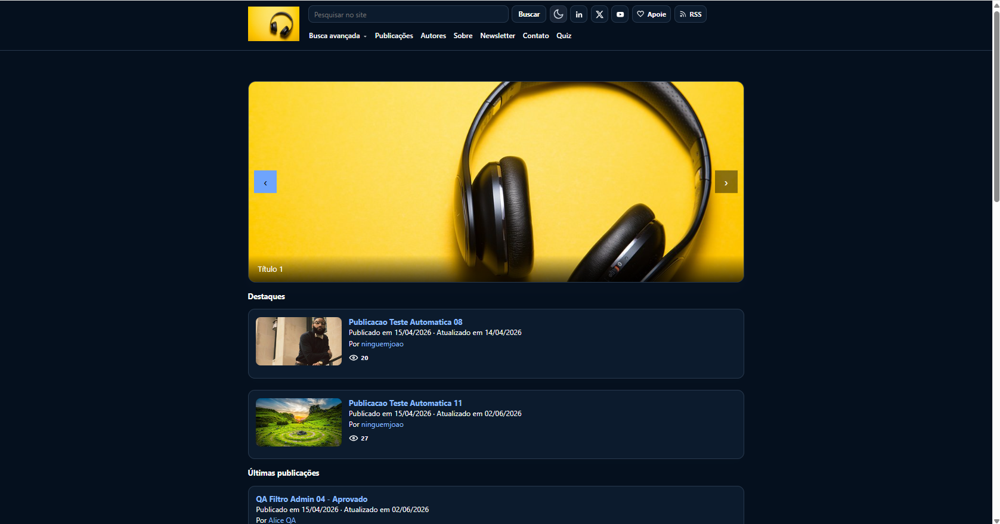
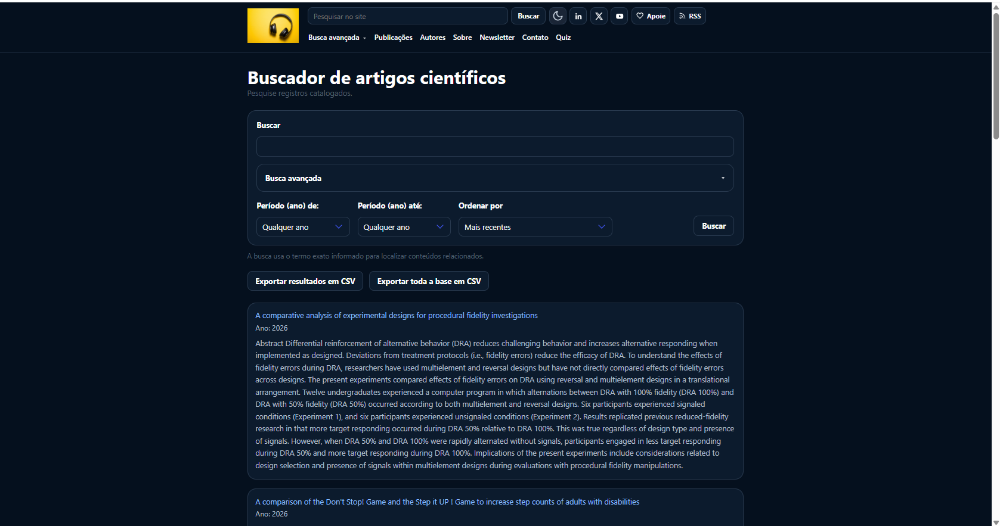
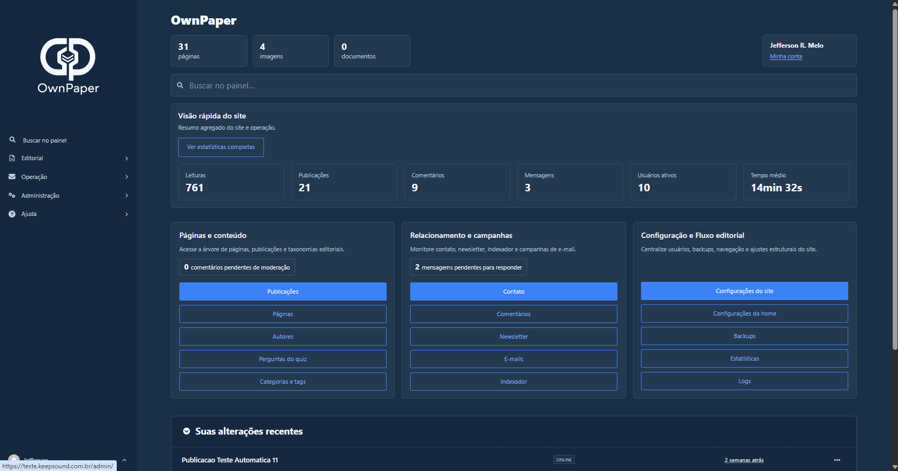
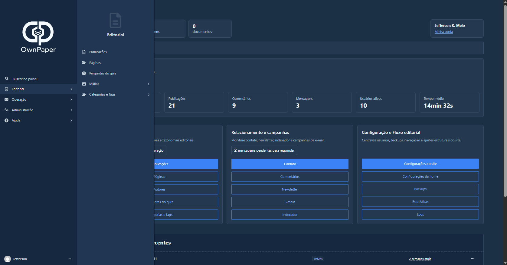
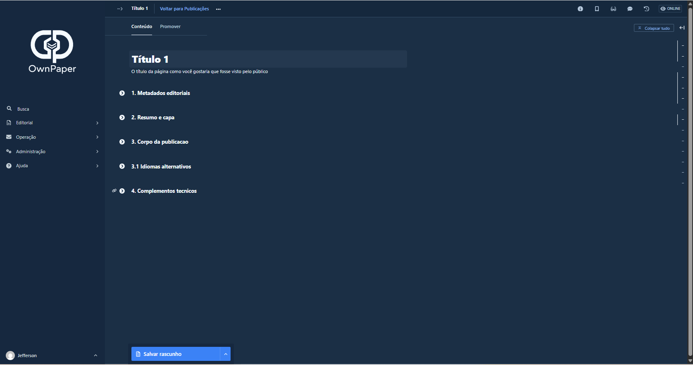
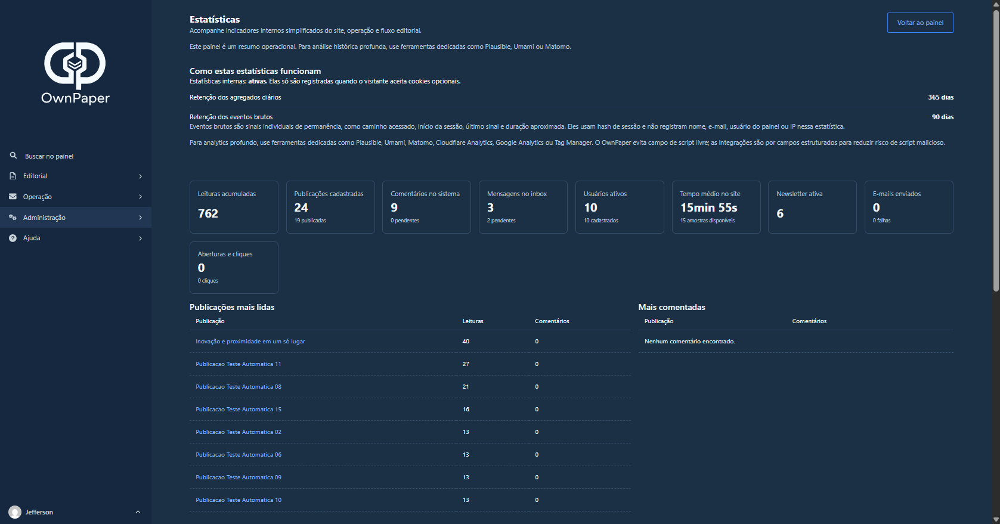
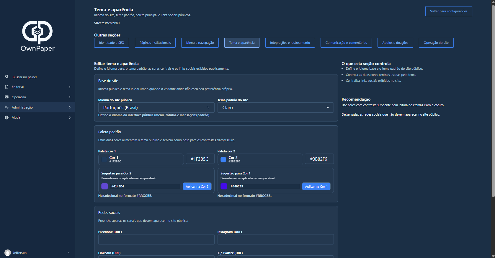

# Tour visual

Esta página reúne prints das principais telas e diferenciais do OwnPaper. Ela não substitui a documentação funcional: serve como referência visual rápida para entender a experiência do painel e do site público.

## Site público

  

    
    
<strong>Home pública.</strong> Destaques, últimas publicações, autoria, navegação e identidade visual do site.

  

  

    
    
<strong>Publicações.</strong> Listagem pública para consulta dos conteúdos publicados.

  

  

    
    
<strong>Notas e referências em pop-up.</strong> Diferencial de leitura que abre complementos sem tirar o leitor do trecho principal.

  

  

    
    
<strong>Quiz público.</strong> Experiência de perguntas reutilizáveis associadas ao conteúdo ou ao estudo.

  

  

    
    
<strong>Indexador.</strong> Busca pública estruturada por dados importados e organizados pelo painel.

  

## Painel administrativo

  

    
    
<strong>Home do painel.</strong> Acesso rápido a conteúdo, operação, configurações, estatísticas e alertas.

  

  

    
    
<strong>Editorial.</strong> Atalhos para publicações, páginas, perguntas do quiz, mídia, documentos, categorias e tags.

  

  

    
    
<strong>Publicações no painel.</strong> Listagem editorial com busca, filtros e acesso direto à edição e ao fluxo editorial.

  

  

    
    
<strong>Perguntas reutilizáveis.</strong> Catálogo centralizado de perguntas para uso em publicações e quiz.

  

  

    
    
<strong>Mídias pendentes.</strong> Quarentena, preview, sanitização e aprovação de imagens, PDFs e vídeos.

  

  

    
    
<strong>Operação.</strong> Contato, comentários, newsletter, indexador, estatísticas, backups, saúde e logs.

  

  

    
    
<strong>E-mails e newsletter.</strong> Disparos, modelos, importação, notificações e operação de comunicação pelo painel.

  

  

    
    
<strong>Estatísticas.</strong> Visão operacional agregada do site, sem substituir ferramentas analíticas dedicadas.

  

  

    
    
<strong>Indexador no painel.</strong> Importação e gestão dos dados usados pelo buscador público.

  

  

    
    
<strong>Administração.</strong> Configurações, fluxo editorial, usuários e gestão operacional do projeto.

  

  

    
    
<strong>Identidade e SEO.</strong> Nome do site, descrição padrão, imagens de compartilhamento, favicon e contato.

  

  

    
    
<strong>Tema e aparência.</strong> Paleta pública, aparência, links sociais e comportamento visual do site.

  

  

    
    
<strong>Minha conta.</strong> Perfil, segurança, notificações, tema, zoom e preferências do usuário administrativo.

  

## Observação

Os prints usam dados de demonstração e mostram apenas as telas mais representativas. A descrição completa de cada recurso está na seção **Funcionalidades** desta documentação.
